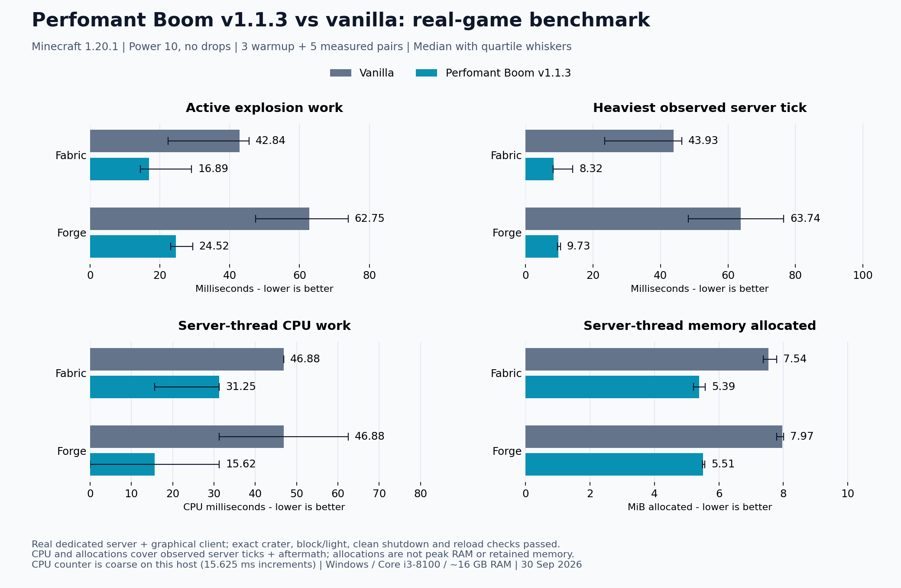

# Perfomant Boom

Large explosions, scheduled across server ticks—and a shared terrain engine for mod integrations.

**Perfomant Boom** provides an administrator explosion command and reusable terrain operations. Its scheduler spreads calculation and block changes across ticks to avoid doing the entire scheduled explosion in one burst.

## Features

- Queue explosions with the operator command `/boom <power>`.
- Spread explosion work across server ticks while keeping live-world access on the server thread.
- Support terrain clearing, fluid cleanup, and boundary repair for mods that use the shared API.
- Integrate the Java API into your own mod while retaining control of effects, damage, timing and saved progress.

## Performance vs vanilla



Measured on **30 September 2026** using real Minecraft **1.20.1 Fabric and Forge dedicated servers and graphical clients**, with power-10 explosions and drops disabled for both engines. Each loader used three warmup pairs and five measured pairs, matching seeds and alternating order. Exact crater, client block/light state, clean shutdown and save/reload checks passed.

In this fixture, Boom reduced the **median heaviest server tick by 81–85%** and **server-thread memory allocations by 28–31%**. These results describe this workload and machine; they are not a universal speedup or FPS claim.

Lower bars are better. The **black whiskers show the middle 50% of measured results**, not the minimum and maximum. CPU and memory measurements include observed server ticks and aftermath work. Memory allocations are cumulative bytes created, **not peak RAM usage**. This Windows host's CPU counter reports coarse 15.625 ms increments: matching CPU readings would not prove identical usage, and this chart cannot establish precise CPU savings.

**v1.1.3** reduces repeated position allocations and chunk lookups. Median allocations were **11–14% below the archived v1.1.2 runs** in this fixture; the separate sessions do not establish a controlled version-to-version timing gain.

See the [benchmark data and reproduction steps](docs/BENCHMARKS.md) for machine details, raw samples and measurement scope.

## Try it

In a disposable test world with cheats enabled, run:

```text
/boom 4
```

The explosion is queued at the command's execution position. Power accepts **1–500**, including decimal values. Power is explosion strength, **not a guaranteed crater radius**; resistant blocks and the surrounding terrain affect the result. Start small.

The command requires game-master/operator permission. Command blocks or `/execute positioned` can supply a different execution position.

## Installation

Choose the file matching your exact Minecraft version and loader.

| Minecraft | Loader | Required mods | Java |
| --- | --- | --- | --- |
| 1.20.1 | Fabric | Fabric API, Architectury API 9.2.14+ | 17 |
| 1.20.1 | Forge | Architectury API 9.2.14+ | 17 |
| 1.21.1 | Fabric | Fabric API | 21 |
| 1.21.1 | NeoForge | None | 21 |
| 26.1.2 | NeoForge | None | 25 |

Fabric targets require Fabric Loader **0.18.4 or newer**. For integrations, follow the consuming mod's client/server requirements and install its additional dependencies. Boom's command works independently.

## What to expect

Ordinary TNT, creeper, and other Minecraft explosions are **not automatically replaced**. Boom processes its command and integrations that explicitly use its engine.

This is not a promise of lag-free explosions or a universal speed multiplier. Chunk loading, lighting, and block callbacks can still take time. General vanilla explosion loot behavior is not reproduced, and custom explosion hooks or protection mods may behave differently. Use backups before destructive commands; Boom is not a protection system.

Queued ordinary Boom explosions are not resumed after a server restart. Completed block changes persist through normal saves. Integrations manage their own saved progress separately.

## Help and feedback

[Source and documentation](https://github.com/UpperMoon0/Perfomant-Boom) · [Report a problem](https://github.com/UpperMoon0/Perfomant-Boom/issues)

Include Minecraft and loader versions, Boom version, command power, installed integrations, and the crash report or latest log. For performance reports, describe the terrain and separate server tick delays from client rendering problems.

Created by **NsTut**. Licensed under the MIT License.
