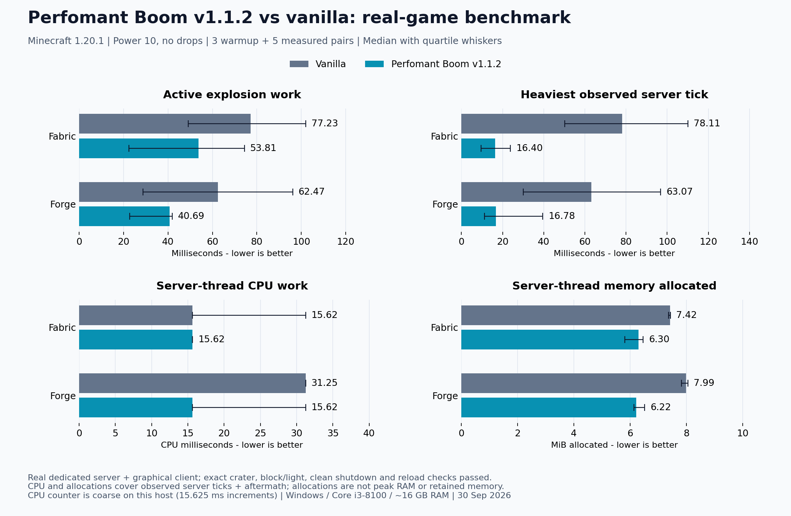

# Archived v1.1.2 real-game benchmark against vanilla



These measurements use a **real Minecraft 1.20.1 dedicated server and graphical client**,
not a synthetic block view or mock world. The same loader/runtime executes both actual
`ServerLevel.explode` and Boom's production `ExplosionScheduler.scheduleTracked`.
The displayed scenario is **power 10 with drops disabled for both engines**.

## Results

| Loader / engine | Active work (ms) | Heaviest tick (ms) | Thread CPU (ms) | Allocated (MiB) |
| --- | --- | --- | --- | --- |
| Fabric / Vanilla | 77.229 | 78.108 | 15.625 | 7.422 |
| Fabric / Boom | 53.811 | 16.403 | 15.625 | 6.299 |
| Forge / Vanilla | 62.474 | 63.072 | 31.250 | 7.991 |
| Forge / Boom | 40.694 | 16.783 | 15.625 | 6.218 |


In this snapshot, Boom lowers the median heaviest tick on both loaders. Fabric records the same median CPU reading for both engines; Forge records lower median CPU for Boom, but coarse counter resolution and overlapping quartiles prevent a precise CPU-saving claim. Memory allocations are lower for Boom in these fixtures. Completion latency can still rise because work is spread across ticks.

Bars show the median of five measured trials per engine and loader. Whiskers show
q1 and q3 (the second and fourth sorted samples). They describe the spread of this
small sample, not confidence intervals or statistical significance. The metrics
have separate axes starting at zero. Timing and allocations depend on the fixture,
hardware, JVM, garbage collection and ambient desktop load; they are not universal
multipliers. Only the no-drops scenario is plotted. Default-loot results are not an
equivalent-functionality comparison because Boom omits general vanilla explosion
loot. The single power-24 stress pair is retained as regression evidence, not plotted
as a statistical benchmark.

## CPU and memory scope

- **Active explosion work (ms):** elapsed time inside vanilla's explosion call or
  Boom's scheduler calls. It excludes the gaps between slices and deferred lighting.
- **Heaviest observed server tick (ms):** maximum start-to-end hook duration for
  each trial, including the inline explosion call and ten aftermath ticks. The chart
  shows the median of those per-trial maxima, not the worst tick of the entire run.
- **Server-thread CPU work (CPU ms):** sum of current-thread CPU counter differences
  over those observed tick intervals, including the inline invocation. This includes
  normal server work and aftermath, and can cover more ticks for a scheduled explosion.
  It excludes CPU used by lighting workers, networking threads, the client, other
  processes and the OS. It is not whole-computer CPU percentage or engine-only CPU time.
- **Server-thread memory allocated (MiB):** sum of thread allocation counter differences
  over the same intervals. This includes normal tick allocations and aftermath.
  Allocation counts represent cumulative Java heap allocations, including objects
  later collected. They do not measure retained objects, peak heap, native memory,
  process working set or total RAM usage. One MiB is 1,048,576 bytes.

The measurements use Java's [thread CPU counters](https://docs.oracle.com/en/java/javase/17/docs/api/java.management/java/lang/management/ThreadMXBean.html)
and [thread allocation counters](https://docs.oracle.com/en/java/javase/17/docs/api/jdk.management/com/sun/management/ThreadMXBean.html).
Unsupported counters fail the live test instead of becoming zero-valued results.
**On this Windows host the recorded CPU increments are 15.625 ms**; a trial recorded
as zero can still have used CPU below the counter's resolution. Small CPU differences
and CPU savings cannot be inferred precisely from these samples. Allocation counts
are JVM estimates and include small measurement overhead. No forced garbage collection
or change to Boom's four-millisecond scheduling budget is used.

Oracle hashing, file I/O and client-acknowledgement waiting are outside the observed
tick resource intervals. Client-acknowledged wall time and observed frame gaps are
retained in the raw evidence; neither is presented as pure explosion completion
latency or FPS. Scheduler wall completion time is also retained per trial.

## Test environment and provenance

- Measured **30 September 2026**, using Perfomant Boom **v1.1.2**.
- Windows 10 Home; Intel Core i3-8100 @ 3.60 GHz, four logical processors; about 16 GB RAM.
- The live launch used **Java 21.0.7**, Java HotSpot 64-Bit Server VM, with a **2 GiB maximum heap**.
  This is the actual recorded live JVM, distinct from the Java 17 unit-test toolchain.
- Isolated loopback-only, offline, disposable flat worlds. Netherrack fixtures with
  glowstone centers and bedrock shells cross chunk/section boundaries. Fixtures use
  radius 13 and explosion power 10; fixture radius is not a crater radius.
- Three warmup pairs followed by five measured pairs per scenario, matching seeds
  and alternating first-run order. A larger power-24 pair is a separate stress check.
- Source base: `41339d29d93ce86535ed052f07a2b66c7011dc6e`. The tested checkout was dirty:
  live-test resource instrumentation was added locally; production explosion code
  was unchanged. It is a development-runtime benchmark, not a packaged-release-JAR
  certification. Both processes were fully prepared before launch, with frozen
  source/class/JAR/launch inputs checked throughout each run.

The [checked-in JSON evidence](benchmarks/live-v1.1.2-1.20.1.json) includes all 34 server
samples and matching client samples per loader (warmups and stress included),
summary quartiles, actual JVM environment, run IDs, source hashes and verification
flags. Original complete logs, launch descriptions and lifecycle/reload receipts
remain in the local `build/live-boom-evidence/<loader>/<run-id>/` directories.

Every captured run must pass exact seeded vanilla/Boom crater checks, exact
server/client block and light checks, two rendered frames after convergence, clean
shutdown, fresh-process save/reload, real chunk replacement and partial-save physics
checks. No benchmark result is accepted solely because it printed a PASS marker.
See [TESTING.md](../TESTING.md) for fixture and verification details.

## Historical reproduction

This snapshot describes v1.1.2. New runs from a later source version produce a separate snapshot; they do not replace these historical results.

Use JDK 21 and Python 3.11+ on a machine capable of launching Minecraft's graphical
client. Run one loader at a time in this checkout; do not edit or rebuild inputs
during either live run. On Windows:

```powershell
python tools/live_boom_test.py --loader fabric --timeout 900
python tools/live_boom_test.py --loader forge --timeout 900
python tools/plot_benchmark.py --capture build/live-boom-evidence/fabric/<run-id> build/live-boom-evidence/forge/<run-id>
```

The capture tool accepts only successful complete live evidence with all resource
metrics; it rejects missing verification gates or source hashes that differ from
the current measured inputs. Update the machine details, chart footer and result
interpretation when measuring on another machine. Use `--require-clean` for release
verification after committing the instrumentation.

The plotting tool requires matplotlib and NumPy. To regenerate the chart without
remeasuring:

```sh
python tools/plot_benchmark.py --data docs/benchmarks/live-v1.1.2-1.20.1.json
```

It uses the mod version saved with the data to name both
[PNG](images/benchmark-live-v1.1.2.png) and [SVG](images/benchmark-live-v1.1.2.svg).
No synthetic or calculation-only timing is used in this README chart.
